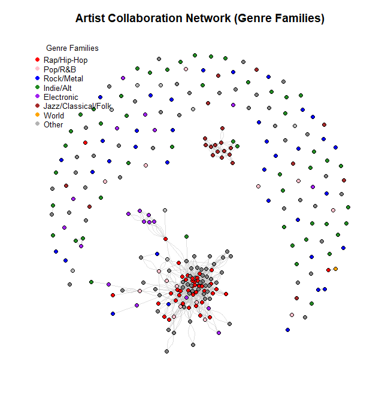

## Overview of the Collaboration Network

The final network contains 279 artists connected by 1177 collaboration edges.

The network is undirected (collaborations are mutual) and unweighted.

Node attributes include artist name, Spotify ID, and genre labels.

Edges represent co-appearances on the same track.

## Genre-Based Visualization

The genre-colored graph shows a highly modular structure.

A large, dense cluster of rap and trap artists dominates the center of the network.

Electronic artists form a compact, fairly isolated cluster.

Rock/metal and indie/alternative artists appear in the outer ring, with fewer interlinks.

Several small, disconnected components appear at the periphery, representing niche genres with few collaborations.

Overall, the visualization highlights genre homophily: artists collaborate mostly with others in the same genre or subgenre.

## Centrality Measures
Top Artists by Degree (Most Collaborative)

Future, Young Thug (66)

Gunna (62)

Lil Durk (61)

Lil Baby (60)

Gucci Mane (58)

21 Savage (57)

Drake (55)

Travis Scott (54)

Offset (51)

Interpretation:

These artists form the core hubs of the network.

They collaborate widely, connecting to many others.

This centrality corresponds to the visible red core in the network plot.

Top Artists by Betweenness (Bridges Across Genres)

A$AP Rocky (0.0283)

Gucci Mane (0.0196)

Yung Lean (0.0192)

Travis Scott (0.0159)

Dean Blunt (0.0113)

21 Savage, Lil Yachty, Drake, Future, Kanye West

Interpretation:

These artists act as brokers between different stylistic clusters.

They lie on many shortest paths, connecting otherwise weakly linked communities.

A$AP Rocky and Dean Blunt bridge mainstream rap with experimental and alternative scenes.

## Network-Level Properties
Clustering Coefficient

Global clustering coefficient: 0.438

Meaning:

There is a high probability that two artists connected to the same artist also collaborate with each other.

This reflects tight-knit creative circles, especially in rap/trap.

Average Path Length

Average path length (giant component): 2.62

Meaning:

Any two artists in the main network are separated by fewer than three steps.

The network displays small-world characteristics:

short paths

strong clustering

This aligns with known behavior in collaboration and social networks.

## Community Detection (Louvain Algorithm)
Community Structure

Louvain detected 152 communities, but most are small.

A few larger communities have sizes: 32, 27, 23, 18.

Many tiny communities (size 1–3) correspond to niche genres.

Genre Composition of Major Communities

The largest communities are dominated by rap, trap, drill, and melodic rap.

An electronic/grime/EDM hybrid community appears (EDM, grime, soft pop, neo-psychedelic).

A distinct classical/vocal/indie cluster emerges (community 126).

A hyperpop/neo-psychedelic cluster appears (community 65).

Rock, indie, shoegaze, progressive metal, surf rock, and similar genres form many small peripheral communities.

Interpretation:

Community assignments closely match the genre families used in the visualization.

Rap/trap dominates the giant component.

Niche genres sit on the periphery with minimal connection to the core.

## Key Findings (Summary for Discussion)

The network shows a core–periphery structure:

Core: Dense rap/trap cluster with high-degree artists.

Periphery: Rock, indie, folk, electronic, and niche genres with fewer collaborations.

Central artists such as Future, Young Thug, Drake, Travis Scott, and Gucci Mane act as major hubs.

A$AP Rocky, Gucci Mane, and Yung Lean serve as bridges linking stylistically different scenes.

The network has strong modularity, short path lengths, and high clustering, confirming small-world network properties.

The structure reflects Mo’s listening patterns:

heavy engagement with rap/trap

secondary interest in indie, rock, electronic

niche genres represented as isolated components.